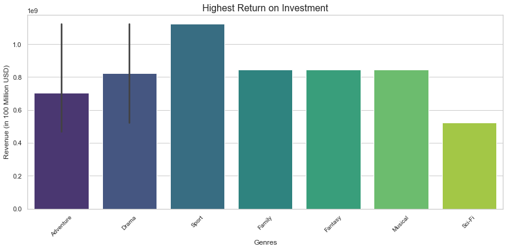

# Rilsoft Studio Insights

## Overview
Rilsoft aims to capitalize on the rising trend of movie creation by establishing a new studio. As newcomers to the industry, the team seeks to leverage data from leading movie review platforms to generate actionable insights that will guide their entry into the competitive movie-making landscape.

## Business Problem
Rilsoft wants to venture in the movie industry to compete with other big companies that create original video content. They have the challenge of determining optimal approach to the market. The problem is how to balance financial investment, creative vision and market demand.

## Data
The data comes from several reputable sources in the movie industry, including Box Office Mojo, IMDB, Rotten Tomatoes, TheMovieDB, and The Numbers. These datasets provide insights into various aspects of movie performance e.g BOM Detailed information on movie performances, release years, and industry statistics.These datasets collectively address questions about box office trends, movie profitability, audience preferences, and the relationship between budgets and revenue.

## Methods
In this project, we use descriptive statistical analysis to explore the movie data. This allows for the identification of key trends and patterns in movie industry for accurate decision making

## Results
The genre that consistently achieved the highest ratings and high ROI was Drama, which cut across both highest rating and high return on investment

Adventure, Drama and Sport gave the highest return on investment. Sport should be considered due to its low budget, Drama cuts across audiences as well as return, while Adventure will deliver the highest return but also with a high budget. 

Musicals were also noted to have the lowest budget with the highest revenue

Roles contributing to the success of high performing movies and movie genres, were : actors, producers,writers, directors and actresses

## Conclusion
The following genres are recommended;
- Adventure, Sports and Drama : Sport should be considered due to its low budget, Drama cuts across audiences as well as return, while Adventure will deliver the highest return but also with a high budget.

The following professions and professions are recommended for success:
 - actors, producers,writers, directors and actresses with the top names being;

  Actors; Sam Hargrave, Doug Mallette, Zachary J. Luna, Chadwick Boseman
  Producers; Alvaro Zendejas, Chadwick Boseman, Elizabeth Olsen
  Writers; Jacob Johnston, Doug Mallette, Chadwick Boseman
  Directors; Doug Mallette, Alvaro Zendejas, Tom Holland
  Actresses; Florence Kasumba, Elizabeth Olsen, Cerris Morgan-Moyer

## Next steps
To provide marketing insights, we would need to have domestic gross per country.
Continued analysis and adaptation to market trends to stay ahead of industry shifts
Geting insights based on demographics e.g. age, gender etc.
Include comments from critics for better insights, to determin genres the studio should undertake

## For More Information
See the full analysis in the [Jupyter Notebook](./index.ipynb) or review this [presentation](./RilsoftStudioInsights.pdf).

For additional info, contact 
John at [john.mugambi@student.moringaschool.com](mailto:john.mugambi@student.moringaschool.com)
Isaiah at [isaiah.juma@student.moringaschool.com](mailto:isaiah.juma@student.moringaschool.com)
Maureen at [maureen.ngahu@student.moringaschool.com](mailto:maureen.ngahu@student.moringaschool.com)
Stella at [stellah.mishi@student.moringaschool.com](mailto:stellah.mish@student.moringaschool.com)
Wilber at [wilberforce.kirui@student.moringaschool.com](mailto:wilberforce.kirui@student.moringaschool.com)

